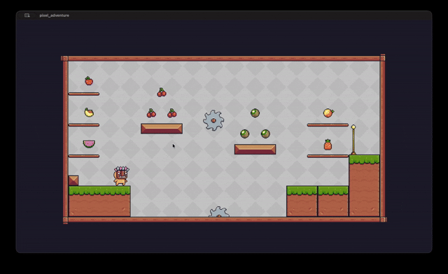
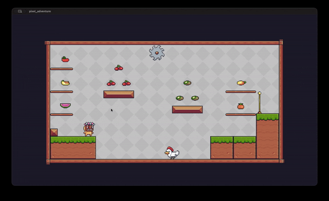

# Pixel Adventure

Pixel Adventure is a 2D platformer built with Flutter and the Flame game engine. The project features side-scrolling levels, animated characters, collectibles, hazards, checkpoints, and simple keyboard controls.

## Overview

This game follows the classic platformer style, where the player runs, jumps, collects fruits, avoids hazards, and reaches checkpoints to progress through the levels. The levels are defined using Tiled maps and rendered through Flame.

## Features

- Side-scrolling platform gameplay
- Animated player states for idle, running, jumping, falling, and hit reactions
- Collectible fruits
- Checkpoints for progress saving
- Hazards such as saws and enemy chickens
- Audio effects for jumps, pickups, and hits
- Built with Flutter + Flame for a lightweight game experience


### Gameplay Level 1



### Gameplay Level 2




## Tech Stack

- Flutter
- Flame
- Flame Tiled
- Flame Audio

## Getting Started

### Prerequisites

- Flutter SDK installed and configured
- A supported emulator or physical device

### Install dependencies

```bash
flutter pub get
```

### Run the game

```bash
flutter run
```

## Controls

- Move: A / D or Left / Right arrow keys
- Jump: Space

## Project Structure

- lib/main.dart — app entry point
- lib/pixel_adventure.dart — main game logic and level handling
- lib/components/ — game objects such as the player, fruit, saws, enemies, and collisions
- assets/ — game images, audio, and Tiled map files

## Notes

This version already includes multiple levels and a playable character with animated interactions. It can be extended with more levels, enemies, UI polish, and additional mechanics.
